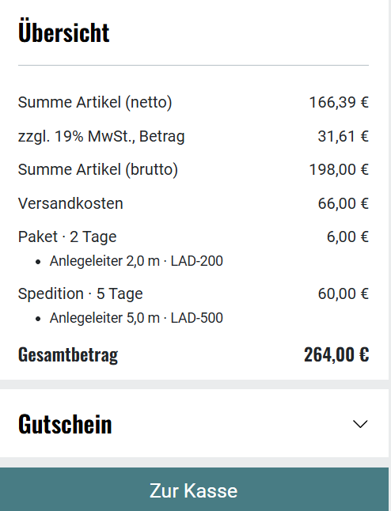
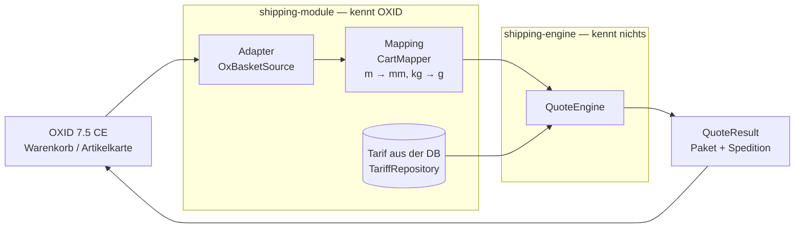
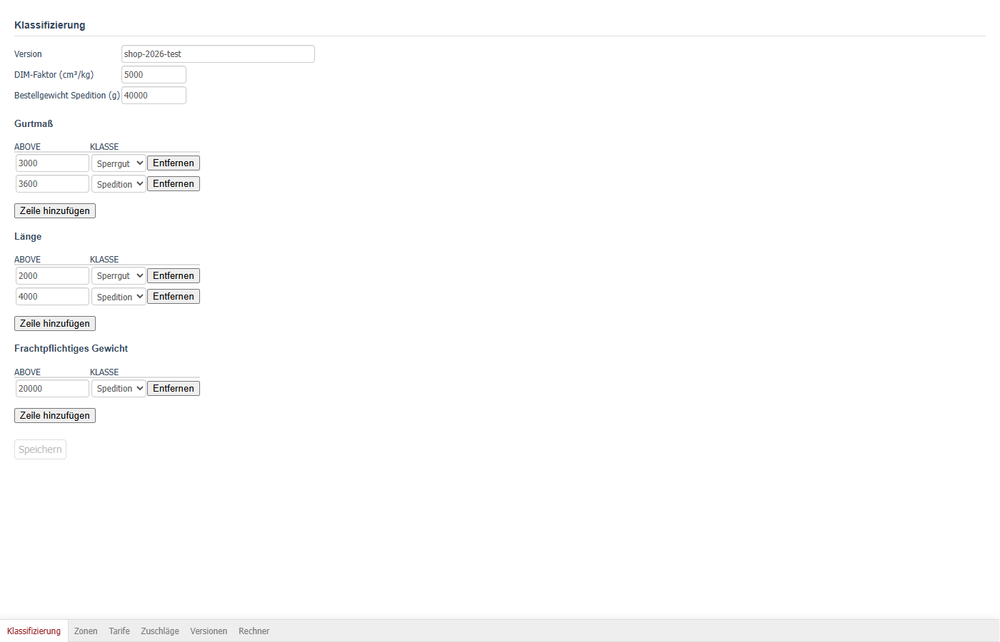
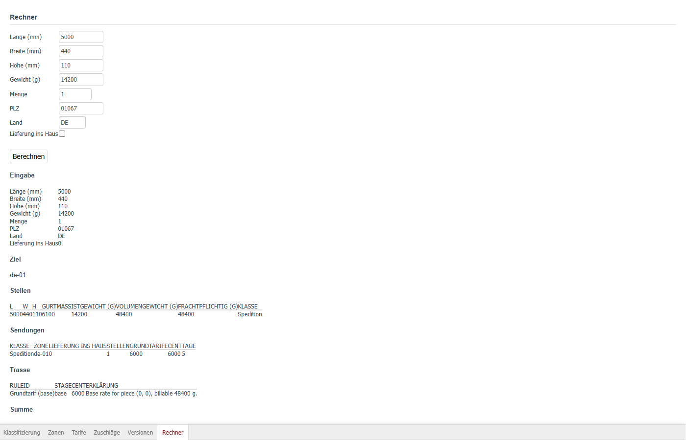
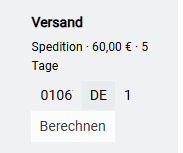
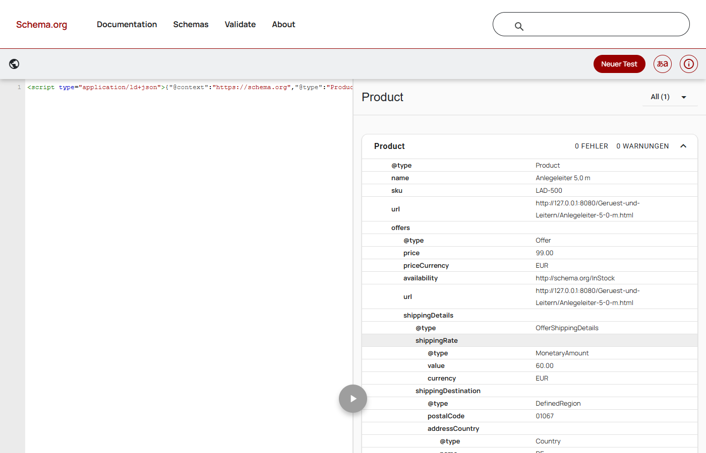

# Versandberechnung für Leitern und Gerüst

[](https://github.com/SigauriM/OXID_Shopsystem/actions/workflows/ci.yml?query=branch%3Amain)


OXID-7-Modul: Versand nach **Länge, Gurtmaß, Gewicht und PLZ**, nicht nach einer Pauschale. Ein Auftrag darf in Paket und Spedition zerfallen; beide Teile werden getrennt bepreist und als eine Bruttosumme ausgewiesen.


## Das Problem

Eine 4-Meter-Leiter ist kein Paket. Paketdienste und Speditionen rechnen nach Länge, Gurtmaß und Gewicht: Oberhalb bestimmter Schwellen wird aus einem Paket Sperrgut, darüber Speditionsware — mit einem völlig anderen Tarif.

Ein Shop mit Versandpauschale hat dann nur zwei Möglichkeiten, und beide sind falsch. Setzt er die Pauschale niedrig an, zahlt er bei jeder langen Position drauf. Setzt er sie hoch an, vertreibt er jeden, der nur eine Schraubzwinge bestellt.

Dieses Modul rechnet stattdessen pro Auftrag: Es vermisst jede Position, klassifiziert sie als Paket, Sperrgut oder Speditionsware, gruppiert die Teile zu Sendungen und bepreist jede Sendung nach dem hinterlegten Tarif.

## Die Regeln

| | Paket → Sperrgut | → Spedition |
|---|---|---|
| Länge | > 2000 mm | > 4000 mm |
| Gurtmaß | > 3000 mm | > 3600 mm |
| Gewicht | | > 20 000 g |
| Bestellgewicht N | | > 40 000 g hebt auf Spedition |

Volumengewicht: `dimFactorCmKg = 5000`.

### Goldfall

**LAD-200 + LAD-500**, PLZ `01067`:

```
Paket         6,00 €
Spedition    60,00 €
─────────────────────
Summe        66,00 €
```

Ein Auftrag, zwei Sendungen, eine Summe im Warenkorb. Die Schwellen oben sind eine **Testfixtur**; produktive Werte kommen über die Tarifverwaltung.

<!-- Screenshot ergänzen und die folgende Zeile einkommentieren: -->
<!--  -->

## Warum so gebaut

**Kern ohne I/O.** Die Rechenlogik liegt als eigenes Composer-Paket `shipping-engine` vor und kennt weder Dateisystem noch HTTP, weder OXID noch PDO. Eingabe ist ein `QuoteRequest`, Ausgabe ein `QuoteResult` — mehr Berührung mit der Außenwelt gibt es nicht. Folge: Die Tests des Kerns laufen in GitHub Actions auf blankem PHP, ohne Shop und ohne Datenbank. OXID lebt ausschließlich im Modul.

**Ganzzahlen statt Fließkomma.** Intern wird in ganzen Millimetern und Gramm gerechnet. Maße und Geld verträgt man nicht mit Fließkomma: Ein akkumulierter Rundungsfehler an der Schwelle von 2000 mm entscheidet darüber, ob eine Position Paket oder Sperrgut ist.

**Einheiten am Rand umrechnen.** OXID pflegt Artikel in **Metern und Kilogramm**, der Kern nimmt **Millimeter und Gramm**. Diese beiden Welten treffen sich an genau einer Stelle, im `CartMapper` des Moduls. Überall sonst gilt nur eine Einheit, und Verwechslungen um den Faktor 1000 können gar nicht erst entstehen.

**Fail closed bei unbekannter PLZ.** Eine Postleitzahl, die der `ZoneResolver` nicht kennt, führt zur Ablehnung — nicht zu einem stillen Festland-Fallback. Ein sichtbarer Fehler im Checkout ist billiger als ein zu niedriger Versandpreis, der erst in der Buchhaltung auffällt.

**Tarif versioniert, Angebot reproduzierbar.** Der Tarif liegt in der Datenbank, jede Fassung mit Hash (`OXHASH`) über `TariffVersion`. Zusammen mit dem `InputSnapshot` im Ergebnis lässt sich nachträglich beantworten, warum ein Auftrag genau diesen Preis bekommen hat.

## Architektur



```
packages/
├── shipping-engine/          reine Berechnung, ohne I/O
│   └── src/
│       ├── Measurement/      Maße, Gurtmaß, Volumengewicht
│       ├── Classification/   Paket / Sperrgut / Spedition
│       ├── OrderRules/       Regeln über den ganzen Auftrag
│       ├── Grouping/         Positionen → Sendungen
│       ├── Zone/             PLZ → Zone, fail closed
│       ├── Tariff/           Preisstufen, Bepreisung
│       └── Result/           Quote, Snapshot, Ablehnungen
└── shipping-module/          OXID-Anbindung
    └── src/
        ├── Adapter/          Warenkorb und Artikel auslesen
        ├── Mapping/          Einheiten umrechnen, validieren
        ├── Tariff/           Tarif laden und versionieren
        ├── Admin/ Sandbox/   Tarifverwaltung und Rechner
        ├── Seo/              JSON-LD auf der Artikelkarte
        └── Logging/          NDJSON-Trace je Angebot
```

## Tarifverwaltung und Rechner

Preisstufen, Zonen und Schwellen werden im Backend gepflegt, nicht im Code. Jede gespeicherte Fassung bekommt ihren Hash.



Dazu ein Rechner direkt im Backend: Maße und PLZ eingeben, Ergebnis samt Klassifizierung sehen — ohne einen Warenkorb zu füllen oder eine Bestellung auszulösen.



## Auf der Artikelkarte

Der Versand wird bereits am Artikel ausgewiesen, für Menge 1, mit derselben Engine wie im Warenkorb.



## SEO / JSON-LD

JSON-LD `Product` auf der Artikelkarte (Menge 1). Geprüft mit [validator.schema.org](https://validator.schema.org/) im Modus **Code** und mit dem Google Rich Results Test im **Code-Modus** (kein öffentlicher Shop-URL). Null Fehler; erwartete Warnungen: fehlendes `handlingTime` und `hasMerchantReturnPolicy`. Staff-RDFa (GoodRelations) bleibt aus — es würde `oxaddsum = 0` als Versandpreis veröffentlichen.



## Qualität und Tests

**415 Testmethoden in 67 Testklassen.** PHPStan Level 6 und PHP_CodeSniffer PSR-12 auf beiden Paketen.

CI auf `main` (Push und Pull Request): PHPUnit, PHPStan 6, PHP_CodeSniffer PSR-12. Kern PHP 8.2 und 8.3, Modul PHP 8.3. **Schreiben des Tarifs in die Datenbank wird nur lokal** im Docker-Shop geprüft, nicht in GitHub Actions.

Die Trennung der beiden CI-Jobs folgt der Architektur: Der Kern braucht keinen Shop-Bootstrap und läuft deshalb über zwei PHP-Versionen, das Modul zieht den Shop und läuft auf 8.3.

Der Workflow pinnt alle Actions auf Commit-SHA und läuft mit `permissions: contents: read` sowie `persist-credentials: false`.

## Schnellstart

Voraussetzung: Docker, dazu Git Bash oder WSL.

```bash
cp .env.example .env   # MYSQL_* und ADMIN_PASSWORD setzen
bash bin/dev-setup.sh
```

Ein Lauf: Docker, Shop, Modul, Tarif, Katalog (Kategorie „Gerüst und Leitern“, zehn Artikel). Shop [http://127.0.0.1:8080](http://127.0.0.1:8080), Admin [http://127.0.0.1:8080/admin/](http://127.0.0.1:8080/admin/). Das Skript ist idempotent und löscht weder Volumes noch Konfiguration.

## Was das Modul nicht tut

Kein Bin-Packing, kein CH/Zoll, keine DHL/DPD-API, kein vollständiges PLZ-Verzeichnis (unbekannte PLZ: fail closed, kein Festland-Fallback). Die Auszeichnung beschreibt nur einen Artikel in Menge 1; `handlingTime` wird nicht behauptet.

## Lizenz

Die Datei `LICENSE` im Wurzelverzeichnis ist die **OXID eShop Community Edition Lizenz 2022** und gilt für den Shop selbst: nichtkommerzielle Nutzung, Evaluierung, Tests und Proof of Concepts.

Die beiden eigenen Pakete unter `packages/` sind davon unabhängig und in ihrer jeweiligen `composer.json` ausgewiesen.
